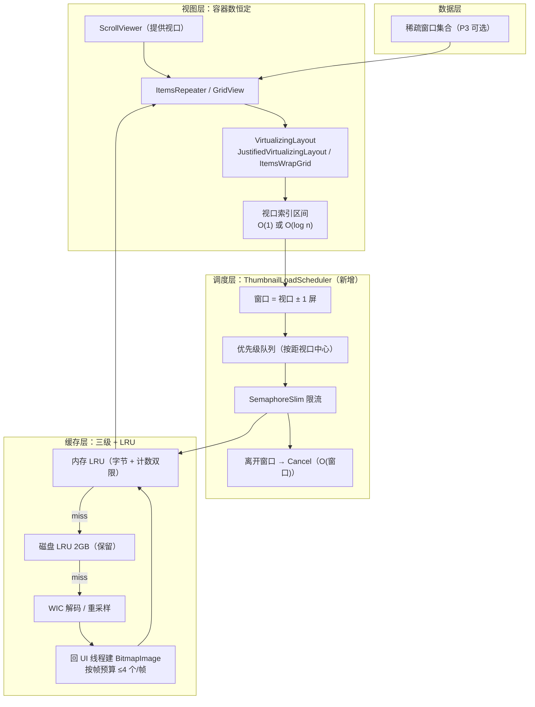

# Pixbian 图库列表性能优化方案

| 项目 | 内容 |
|---|---|
| 文档日期 | 2026-09-06 |
| 适用范围 | `src/Pixbian`（图库页列表渲染与缩略图管线） |
| 技术栈 | WinUI 3 / WASDK 2.4.0 元包（WinUI 实为 2.3.6）/ net8.0-windows10.0.26100.0 |
| 数据规模 | 媒体库约 2.5 万条（机械盘 D:） |
| 问题现象 | 列表加载到后面，随文件数量增加占用资源越多，应用明显卡顿 |
| 当前状态 | **待执行** —— 已决策，先自行验证根因，验证通过后再按本文档实施 |

## 当前状态（2026-09-06）

### 已决策

| 项 | 决策 | 备注 |
|---|---|---|
| P0 四项止损 | **暂缓** —— 先按 [第十二章](#十二验证实验操作指南执行前必读) 自行坐实根因 | 验证通过后再执行 |
| 诊断日志 | **A：彻底删除** `Diagnostics` 类及全部埋点调用 | ⚠️ **必须在验证完成之后执行**，否则 `THUMBSUBMIT` / `PANEL` 埋点消失，无法验证 |
| 整体节奏 | **待定**（未选） | 验证结果出来后再定；推荐 ② 分两段 |

### 下一步动作

1. 按第十二章跑三个验证实验；
2. 把 `THUMBSUBMIT` 序列与 `LOADTOTAL` 变化贴回，确认 R1 / R2 / R4；
3. 确认后依次执行：**删除诊断埋点 → P0-1 → P0-3 → P0-4 →（按节奏）P1a → P1b**；
4. 每步按第八章验收标准验证。

> ⚠️ **顺序约束**：验证（依赖埋点）→ 删除埋点 → P0 其余项。**三者不可颠倒**。

## 目录

- [一、问题定性](#一问题定性)
- [二、根因清单](#二根因清单)
- [三、对标应用分析](#三对标应用分析)
- [四、技术底数验证](#四技术底数验证)
- [五、关键决策与否决项](#五关键决策与否决项)
- [六、目标架构](#六目标架构)
- [七、执行方案](#七执行方案)
- [八、验收标准](#八验收标准)
- [九、风险与回滚](#九风险与回滚)
- [十、工作量估算](#十工作量估算)
- [十一、决策记录](#十一决策记录)
- [十二、验证实验操作指南（执行前必读）](#十二验证实验操作指南执行前必读)
- [附录 A：验证实验原理](#附录-a验证实验原理)
- [附录 B：API 验证证据](#附录-bapi-验证证据)

---

## 一、问题定性

**不是"解码慢"，而是三条 O(n)（甚至 O(n²)）成本随条目数线性累积，叠加一个把历史条目反复重新解码的放大器。**

其中 R1 是**一行代码级别的缺陷**，也是"越加载越卡"的主因。

---

## 二、根因清单

### R1 ★★★ 翻页时把「全部历史条目」重新提交解码（最致命）

`src/Pixbian/ViewModels/GalleryViewModel.cs:864`

```csharp
pending = _items.Where(i => i.Thumbnail is null).ToList();
```

`pending` 取的是**整个 `Items` 集合**，不是本页新增的 200 条。而以下"头部瘦身"又把视口外历史条目的位图置空：

`src/Pixbian/ViewModels/GalleryViewModel.cs:839-846`

```csharp
var excess = _items.Count - MaxResidentThumbnails;
for (var i = 0; i < excess; i++)
{
    var stale = _items[i];
    stale.CancelPendingLoad();
    _thumbnails.Release(stale.Item.Path);
    stale.Thumbnail = null;
}
```

**两者叠加形成自激循环：**

| 已翻页次 | Items 数 | 被瘦身置空 | 本次提交解码数 |
|---|---|---|---|
| 1 | 200 | 0 | **200** |
| 3 | 600 | 300 | **500** |
| 5 | 1000 | 700 | **900** |
| 10 | 2000 | 1700 | **1900** |

第 10 页一次提交 1900 条解码，每条都要过信号量、走磁盘 IO、回 UI 线程创建 `BitmapImage`。**这是"文件数越多越卡"的数学解释。**

### R2 ★★★ 两个视图实际上完全没有 UI 虚拟化

- `JustifiedPanel` / `SquarePanel` 都直接继承 `Panel`，不是 `VirtualizingPanel` → GridView 退化为一次性 Realize 全部容器；
- **更关键**：GridView 被外层 `ScrollViewer` 包裹，视口在外层，内层面板永远拿不到 viewport → 即使换成虚拟化面板也不会生效。

`src/Pixbian/Views/GalleryPage.xaml:581-601`

```xml
<ScrollViewer x:Name="JustifiedView" Grid.Row="2" ... ViewChanged="OnScrollViewChanged">
    <GridView x:Name="JustifiedGridView" ContainerContentChanging="OnContainerContentChanging" ...>
```

`src/Pixbian/Views/GalleryPage.xaml:679-684`（自适应视图）、`:784-796`（方形视图）

```xml
<controls:JustifiedPanel Spacing="12"/>
...
<controls:SquarePanel ItemSize="{Binding GridItemWidth}" Spacing="8"/>
```

每个条目视觉树 ≈ GridViewItem(Grid + ContentPresenter + MaskBorder + SelectionRing + CheckBox) + DataTemplate(Border + Grid + ThumbnailPresenter[4 元素] + 时长 Border + Button + FontIcon) ≈ **30~40 个 UI 元素**。

> 1000 条 = **3~4 万个常驻元素**，任何一次 `InvalidateMeasure` 都是全量 measure + arrange。

### R3 ★★ 滚动停止时的全量 × 线性查找扫描（O(n²)）

`src/Pixbian/Views/GalleryPage.xaml.cs:910-940`

```csharp
foreach (var item in ViewModel.Items)
{
    if (!item.ContainerEverRealized) continue;

    var visible = false;
    foreach (var grid in grids)
    {
        if (grid.ContainerFromItem(item) is not null) { visible = true; break; }
    }
    if (!visible) item.CancelPendingLoad();
}
```

遍历**全集合** × 每个 item 调 `ContainerFromItem`（代码注释自述"为线性查找"）→ **O(n²)**。1000 条时每次滚动停止在 UI 线程同步跑约 10⁶ 次比较。`_lastScanOffsets` 判重只在偏移**完全不变**时生效，正常滚动每帧都变，等于没有。

### R4 ★★ 解码管线上的同步文件 IO（且全局锁）

`src/Pixbian/Services/Diagnostics.cs:23-38`

```csharp
public static void Log(string line)
{
    var entry = $"{DateTimeOffset.Now:HH:mm:ss.fff}|{line}{Environment.NewLine}";
    lock (Gate)
    {
        try { File.AppendAllText(LogPath, entry); }
        ...
```

每条缩略图至少写 3 行（`DISK|`、`BITMAP|`、`THUMB|`），是 **`open + write + close` 同步阻塞 IO，且在全局锁下串行化**。200 条一批 = 600 次串行文件写；机械盘单次小文件写入常在毫秒级 → 光日志就能吃掉数秒，且**所有解码线程卡在同一把锁上**。文件头自述"取得基线后必须连同全部埋点调用一并删除"，一直未删。

### R5 ★★ 面板测量期的副作用与 O(n) 分配

`src/Pixbian/Controls/JustifiedPanel.cs:96`

```csharp
SyncItemSubscriptions();
```

每次 measure 都新建 `HashSet` + `Except` + 逐个订阅（O(n) 且产生垃圾）；`:138-144` 的 `ApplyDisplaySize` 在 **measure 内部**发起异步解码请求；任一一条 `AspectRatio` 变化 → `:245-251` 的 `InvalidateMeasure` → 全量重排。这是历史 `LayoutCycleException` 的温床。

### R6 ★ 位图内存策略与解码策略互相打架

`GalleryViewModel.cs:49` 的 `MaxResidentThumbnails = 300`（按**索引头部**回收）与 `App.xaml.cs:144` 的 `MemoryCache SizeLimit = 200MB`（≈200 条 512² 位图）是两套不一致的口径，且回收后条目被 R1 立刻重新提交解码 → 「释放 → 重解 → 再释放」循环。

### R7 ★ 数据与订阅无上限增长

`Items` 只增不减；`JustifiedPanel._subscribed` 随条目数线性增长（每条目一个 `PropertyChanged` 订阅）；`ThumbnailService._dimensions` 无界。

---

## 三、对标应用分析

### 3.1 结论

**主参考 Windows 照片应用（Microsoft Photos），辅以文件资源管理器的缩略图管线范式，架构思想借鉴 Google Photos。明确不以 Lightroom 为蓝本。**

> 说明：微软未公开照片应用的内部实现细节，以下判断是可自行取证的推断，而非确证（取证方法见 3.5）。

### 3.2 为什么是照片应用

| 维度 | 照片应用 | Pixbian | 匹配度 |
|---|---|---|---|
| 技术栈 | WinUI 3 + WASDK | WinUI 3 + WASDK 2.4 | 完全一致 |
| 布局版式 | 等高 Justified | `JustifiedPanel` 已在复刻 | 完全一致 |
| 交互范式 | hover 复选框 → 进入选择模式、单击延迟打开 | 已照抄该范式 | 完全一致 |
| 平台约束 | `BitmapImage` 无 mipmap、插值不可控、必须按物理像素解码 | 踩过同样的坑 | 完全一致 |
| 数据规模 | 数千 ~ 数万本地文件 | 2.5 万条 | 同量级 |

**关键点：`JustifiedPanel` 的分行算法不用重写。** 照片应用的启示不是"布局算法更好"，而是**承载布局的底座必须虚拟化**。要换的是"地基"（`Panel` → `VirtualizingLayout`），"户型"（贪心分行、行内等比缩放、缩放因子钳制 [0.5,1.5]、回写实际显示尺寸）可 1:1 保留。

### 3.3 三个对标对象：抄什么 / 不抄什么

| 对标 | 抄（性能与架构） | 不抄 |
|---|---|---|
| **Windows 照片应用**（主） | ① `ItemsRepeater` + 自定义 `VirtualizingLayout` 承载等高布局<br/>② 缩略图按**视口索引**驱动加载、离开视口即取消<br/>③ 索引预存宽高，避免每次打开文件头探测（Pixbian 已有 `MediaMetadataBackfillService`，做对了）<br/>④ 内存 LRU → 磁盘 → 解码三级缓存 | 时间线分组 / 人物聚类 / AI 语义搜索 / 云同步（产品功能，与性能无关） |
| **文件资源管理器**（辅） | 缩略图**优先级队列**：可见项插队、滚动时重排优先级、取消不可见请求。直接对应待建的 `ThumbnailLoadScheduler` | 系统缩略图缓存 `IThumbnailProvider`——图片路径上刻意绕开它是对的，仅视频路径保留 |
| **Google Photos**（思想） | **窗口化数据源**：只实例化视口附近的 VM；预取 ±1 屏；位图按"最后使用时间"LRU | Web/Android/iOS 实现细节不可迁移；云端流式加载与按需分辨率不适用于本地浏览器 |

### 3.4 明确不建议

- **Lightroom Classic**：其性能建立在「导入即建目录 + 后台生成 1:1 智能预览（DNG）」的预算上。Pixbian 定位是"浏览器而非编辑器"，没有导入环节，不该背这套成本。其 catalog（重量级 SQLite + 侧车预览）与轻量索引不是一个量级。**抄它 = 过度工程。**
- **Eagle / digiKam**：Electron / Qt 栈，虚拟化与缓存机制无法迁移。
- **XnView / FastStone**：单线程老架构，2.5 万条规模下本身即为反面教材。

### 3.5 照片应用技术栈的取证方法（可选，约 10 分钟）

1. **查控件树**：用 Windows SDK 自带的 `Inspect.exe`（或 Accessibility Insights）挂到照片应用主窗口，看主列表 `ClassName`。
   ⚠️ **只看类名，不要按文本查找**——WinUI 的 `TextBlock` 不把 `Text` 暴露为 UIA `Name`，按文本查找必然失败。
   若出现 `ItemsRepeater` / `ScrollViewer` 嵌套且子容器数远小于图片总数，即为虚拟化实锤。
2. **查依赖**：`C:\Program Files\WindowsApps\Microsoft.Windows.Photos_*` 下是否含 `Microsoft.UI.Xaml.dll` / WindowsAppSDK 运行时，确认是 WASDK 应用而非老 UWP。
3. **对照样本**：`microsoft/WindowsAppSDK-Samples` 与 WinUI 3 Gallery 中的 `ItemsRepeater` 官方示例，可直接作为 `VirtualizingLayout` 的脚手架。

### 3.6 诚实提醒

**照片应用在超大库（10 万+）上同样会卡，它不是银弹。** 但 2.5 万条规模下，完成 P0 + P1a + P1b 即可进入"丝滑"区间，P2 可按需投入。

> **技术路线抄照片应用，规模野心不抄 Lightroom。**

---

## 四、技术底数验证

全部在本机包内验证（WASDK 2.4.0 → WinUI 2.3.6），**非文档推断**。
验证文件：`C:\Users\Baiwanyi\.nuget\packages\microsoft.windowsappsdk.winui\2.3.6\lib\net6.0-windows10.0.17763.0\Microsoft.WinUI.xml`

| 项 | 结论 | 证据行 |
|---|---|---|
| `VirtualizingLayout` / `VirtualizingLayoutContext` / `ElementRealizationOptions` | **可用** | 29906 / 29938 / 17081 |
| 可重写成员 | `MeasureOverride(ctx, Size)`、`ArrangeOverride(ctx, Size)`、`InitializeForContextCore`、`OnItemsChangedCore`、`UninitializeForContextCore` | 29912 / 29922 / 29918 / 29928 / 29934 |
| Context 能力 | `ItemCount`、`RealizationRect`、`VisibleRect`、**可写** `LayoutOrigin`、`RecommendedAnchorIndex`、`GetItemAt(i)`、`GetOrCreateElementAt(i, opts)`、`RecycleElement(el)` | 29944–30016 |
| `ElementRealizationOptions` | `None` / `ForceCreate` / `SuppressAutoRecycle` | 17084–17092 |
| `ItemsRepeater` | `Layout`、`ElementPrepared`、`ElementClearing`、`ElementIndexChanged`、`GetElementIndex(el)`、`GetOrCreateElement(i)`、`TryGetElement(i)` | 19245–19274 |
| `IScrollInfo` | **不存在**（滚动契约未公开） | 全文检索 0 命中 |
| `SelectionModel` | **不存在** | 全文检索 0 命中 |
| `ItemsWrapGrid` | 支持 `ItemWidth` / `ItemHeight` / `Orientation` / `MaximumRowsOrColumns` | 19709–19745 |
| `VirtualizingPanel` | 类型存在（可继承） | 30018 |

---

## 五、关键决策与否决项

### 决策 1 —— 自定义 `VirtualizingPanel` 作为 GridView 的 ItemsPanel：**否决**

`VirtualizingPanel` 类型存在且可继承，成员含 `ItemContainerGenerator`、`AddInternalChild`、`InsertInternalChild`、`RemoveInternalChildRange`、`OnItemsChanged`、`BringIndexIntoView`。

**但 WinUI 3 未公开 `IScrollInfo`**——即虚拟化面板与宿主 ScrollViewer 之间报告 `Extent/Viewport/Offset` 的契约。第三方面板无法向 ScrollViewer 汇报逻辑尺寸，滚动条与虚拟化都会失效。这正是微软另起炉灶做 `ItemsRepeater + VirtualizingLayout` 的原因。

> **唯一官方扩展点是 `ItemsRepeater` + `VirtualizingLayout`。**

### 决策 2 —— 换 `ItemsRepeater` 就必须自建选择服务

本版本**没有** `SelectionModel`。当前 `GalleryPage` 大量依赖 GridView 的 `SelectedItems` / `SelectionMode` / `SelectionChanged` / `ItemClick` / `ContainerFromItem` / 模板内 `IsSelected` 双向绑定——这些在 `ItemsRepeater` 上一个都没有。**这是 P2 的主要成本。**

### 决策 3 —— 方形视图有低风险捷径

换成 `ItemsWrapGrid` + 动态 `ItemWidth`，**仍是 GridView**，选择机制零改动即可拿到原生虚拟化。

### 决策 4 —— 分阶段推进，每阶段可独立验证与回滚

---

## 六、目标架构



**三条铁律**

1. **容器数恒定**（≤ 视口 + 2 屏），与总条目数无关；
2. **解码请求数 = O(视口)**，不是 O(集合)；
3. **内存按 LRU / 字节回收**，不是按索引。

---

## 七、执行方案

```
阶段一 P0   止损              4 项小改            → 消除线性放大，风险≈0
阶段二 P1a  方形视图虚拟化     低风险捷径          → 原生虚拟化，选择机制零改动
阶段三 P1b  调度器 + LRU       核心               → 解码与内存回到 O(视口)
阶段四 P2   自适应视图改造     最大收益/最大成本   → 真虚拟化
阶段五 P3   稀疏数据源         可选               → 2.5 万条量级可不做
```

### 7.1 阶段一 P0：止损（建议立即执行）

#### P0-1　`pending` 只取本页新增 —— 消除 R1

在 UI 块内维护本页新建的 VM 列表，取代全集合扫描：

```csharp
// GalleryViewModel.ExecuteLoadAsync 的 UI 块内
var added = new List<MediaItemViewModel>(page.Count);

if (reset)
{
    var fresh = new ObservableCollection<MediaItemViewModel>();
    foreach (var item in page)
    {
        var vm = new MediaItemViewModel(item, _thumbnails.LoadThumbnailAsyncCore);
        fresh.Add(vm);
        added.Add(vm);
    }
    ReplaceItemsCore(fresh);
    _loadedCount = 0;
}
else
{
    foreach (var item in page)
    {
        var vm = new MediaItemViewModel(item, _thumbnails.LoadThumbnailAsyncCore);
        _items.Add(vm);
        added.Add(vm);
    }
    // 瘦身处改为：只淘汰「距视口最远」的条目并标记 IsEvicted（见 P1b）
}

pending = added;
```

> `SetThumbnailSizeAsync` / `RefreshThumbnailsAsync` 的全量语义**保留**（切档位确实要全量重解），但改为经调度器按窗口提交。

**验证**：连续翻 5 页，`THUMBSUBMIT|N` 应保持恒定 ≈200，而非 200→400→600…

#### P0-2　拆掉解码管线上的同步 IO —— 消除 R4

- **方案 A（彻底）**：删除 `Diagnostics` 类及全部埋点调用（涉及 `GalleryViewModel`、`ThumbnailService`、`GalleryPage.xaml.cs`、`JustifiedPanel`、`App.xaml.cs`）。
- **方案 B（推荐）**：改造为异步 + 默认关闭。

```csharp
// Channel<string> 无界队列 + 单个后台消费者批量落盘（每 500ms 或满 256 行）
public static void Log(string line)
{
    if (!_enabled) return;                                   // 默认关闭，零成本
    if (_sampleRate < 1.0 && Random.Shared.NextDouble() > _sampleRate) return;
    _channel.Writer.TryWrite($"{DateTimeOffset.Now:HH:mm:ss.fff}|{line}");
}
```

**验证**：开关前后对比 `LOADTOTAL|` 耗时。

#### P0-3　取消扫描窗口化 —— 消除 R3

- **短期（本次做）**：维护 `_lastVisibleRange`，只扫描「上次窗口 ∪ 本次窗口」差集，并加 150ms 节流。
- **长期（P2 顺带）**：`JustifiedPanel` 暴露行偏移表，页面按 Y 二分查找 → O(log n)，彻底消灭扫描。

```csharp
/// <summary>每行起始 Y 偏移（长度 = 行数 + 1），measure 后填充。</summary>
internal IReadOnlyList<double> RowOffsets => _rowOffsets;
/// <summary>每行首个条目的数据索引（长度 = 行数），用于索引 ↔ 行号换算。</summary>
internal IReadOnlyList<int> RowStartIndices => _rowStartIndices;
```

#### P0-4　订阅同步改脏标记 —— 消除 R5

`Children.Count` 变化或元素回收时置 `_subscriptionsDirty = true`，measure 时仅在 dirty 时重建，不再每次 measure 新建 `HashSet` + `Except`。

### 7.2 阶段二 P1a：方形视图原生虚拟化（低风险，先拿收益）

**核心动作：去掉外层 `ScrollViewer`，改用 `ItemsWrapGrid`。**

1. 删除 `<ScrollViewer x:Name="GridViewView">` 外壳，让 `GridViewControl` 自身滚动；
2. `ItemsPanel` 换为 `ItemsWrapGrid`；
3. 触底翻页迁移到已有的 `OnGridViewControlLoaded`（其中已 `FindDescendant<ScrollViewer>` 并订阅 `ViewChanged`）；
4. 为保留"均匀放大填满行宽"的观感，动态计算格子边长：

```csharp
private void UpdateWrapGridCellSize(double availableWidth)
{
    const double spacing = 8;
    var target = ViewModel.ThumbnailSize + 8;                  // 档位 + 内边距
    var perRow = Math.Max(1, (int)Math.Round((availableWidth + spacing) / (target + spacing)));
    var edge = (availableWidth - spacing * (perRow - 1)) / perRow;

    if (_wrapGrid is not null)
    {
        _wrapGrid.ItemWidth = edge;
        _wrapGrid.ItemHeight = edge;
    }
}
```

**收益**：原生虚拟化生效，容器数恒定；GridView 的选择机制、`ItemClick`、`ContainerContentChanging`、右键菜单、双击收藏**全部零改动**。
**代价**：`SquarePanel` 的精确填满行为改为动态 `ItemWidth` 近似（视觉等价）。

> ⚠️ **反直觉点**：**GridView 不能外层包 ScrollViewer，而 `ItemsRepeater` 必须外层包 ScrollViewer。**
> GridView 靠内部 ScrollViewer 提供视口；ItemsRepeater 靠外部 ScrollViewer 计算 `RealizationRect`。阶段二与阶段四方向相反，切勿套错。

### 7.3 阶段三 P1b：解码调度器 + 位图 LRU（核心）

#### 7.3.1 `ThumbnailLoadScheduler`（新建）

取代「整页提交 + `Task.Delay` 批间隔」与「全量扫描取消」：

```csharp
public sealed class ThumbnailLoadScheduler : IDisposable
{
    /// <summary>更新可见索引区间；重算窗口、入队新项、取消离开窗口的在途项。</summary>
    public void UpdateViewport(int firstVisibleIndex, int lastVisibleIndex);

    /// <summary>档位或缩放比变化：整体重排队列（保留全量重解语义，但按窗口提交）。</summary>
    public Task RefreshAsync(IReadOnlyList<MediaItemViewModel> items);

    /// <summary>切换视图 / 筛选：立即清空队列并取消全部在途请求。</summary>
    public void Reset();
}
```

实现要点：

| 要点 | 做法 |
|---|---|
| 窗口 | `[first - prefetch, last + prefetch]`，prefetch = 1 屏条目数 |
| 优先级 | 到视口中心的距离，近者优先（快速滚动时先出用户正在看的） |
| 并发 | 沿用现有 `SemaphoreSlim(DecodeConcurrency)` |
| 取消 | 离开窗口的条目 `CancelPendingLoad()`，代价 O(窗口)，与总条目数无关 |
| 回 UI | 位图创建是 UI 线程专属（`BitmapImage` 是 `DependencyObject`），改为**按帧预算提交**（每帧 ≤4 个），替代"批 10 + 间隔 40ms" |
| 去重 | 保留 `_inflightSize` 只升不降 + 容差的既有逻辑 |

#### 7.3.2 位图 LRU（替换头部瘦身）

- 废弃 `MaxResidentThumbnails` 按索引回收；
- 内存层以 `IMemoryCache` 的 `SizeLimit`（`App.xaml.cs:144`，200MB）为唯一口径；
- 注册 `PostEvictionCallback`，淘汰时置空条目 `Thumbnail` 并打 `IsEvicted` 标记；
- **`IsEvicted` 必须与"从未加载"区分**：被淘汰项仅在**进入视口**时才重新解码，不参与预取。

> 这一条是打断「释放 → 重解 → 再释放」自激循环的关键。

#### 7.3.3 磁盘缓存保留

`ThumbnailDiskCache`（LRU 2GB）+ `Release()` 只清内存不清磁盘的设计正确，保持不变。

### 7.4 阶段四 P2：自适应视图 `ItemsRepeater` + `JustifiedVirtualizingLayout`

#### 7.4.1 虚拟化布局骨架

从现有 `JustifiedPanel` 迁移贪心分行算法——**算法不用重写，只换基类与元素获取方式**：

```csharp
public sealed class JustifiedVirtualizingLayout : VirtualizingLayout
{
    protected override Size MeasureOverride(VirtualizingLayoutContext context, Size availableSize)
    {
        // 1. 锚点：context.RecommendedAnchorIndex，定位到行偏移表
        // 2. 二分查找 RealizationRect 覆盖的行区间            → O(log n)
        // 3. 仅对区间内行：context.GetOrCreateElementAt(index, ElementRealizationOptions.RecycleElement)
        // 4. 区间外行：context.RecycleElement(element)
        // 5. 写 context.LayoutOrigin（虚拟内容偏移），维护行偏移表
        // 6. 返回 Extent（未测量行按 RowHeight 估算）
        return extent;
    }

    protected override Size ArrangeOverride(VirtualizingLayoutContext context, Size finalSize)
    { /* 复用行内排列逻辑 */ }

    protected override void OnItemsChangedCore(
        VirtualizingLayoutContext context, object source, NotifyCollectionChangedEventArgs args)
        => InvalidateLayoutTable();     // 数据变化 → 行偏移表失效，下次 measure 重建
}
```

#### 7.4.2 技术核心：行偏移表

Justified 布局是变高的，第 i 行的 Y 依赖前面所有行，每行高度又依赖该行条目的宽高比。要支持滚动条任意拖拽（而非仅顺序滚动），必须有 O(log n) 的「Y ↔ 行号」映射：

| 结构 | 内容 | 重建时机 | 复杂度 |
|---|---|---|---|
| `_rowOffsets` | 每行起始 Y（长度 = 行数 + 1） | 数据变化 / 宽高比批量写回 / 可用宽度变化 | 建表 O(n)，查询 O(log n) |
| `_rowStartIndices` | 每行首个条目索引 | 同上 | — |

- 宽高比是**批量写回**的（`PrefetchDimensionsAsync` 已如此），重建次数有限；
- 表失效期间未测量的行用 `RowHeight` 估算参与 extent，避免抖动；
- 这正是照片应用处理等高布局的做法：先算全量几何表，再按视口 realize。

#### 7.4.3 选择服务（本阶段最大成本）

因无 `SelectionModel`，需自建：

```csharp
public sealed class GallerySelectionService
{
    public IReadOnlyList<int> SelectedIndices { get; }     // 基于索引，不与容器耦合
    public bool IsSelected(int index);
    public void Select(int index);                          // 单击
    public void Toggle(int index);                          // Ctrl + 单击
    public void SelectRange(int from, int to);              // Shift + 范围
    public void SelectAll();
    public void Clear();
    public event EventHandler? SelectionChanged;
}
```

需迁移的现有交互（`GalleryPage.xaml.cs`）：
`EnterSelectionMode` / `ExitSelectionMode` / `CollectSelection` / `OnSelectionChanged` / `SelectAll` / `_suppressAutoEnterOnce` / 模板内 `IsSelected` 双向绑定 / 复选框 hover 浮现。

宿主事件改用 `ElementPrepared`（挂 DataContext、绑定 VM 的 `IsSelected`）、`ElementClearing`（解绑）、`GetElementIndex(element)`（命中测试定位索引，替代 `ContainerFromItem`）。

**工作量预估：约 300–400 行，含键盘导航与 hover 复选框。**

### 7.5 阶段五 P3：稀疏数据源（可选）

`Items` 改为稀疏窗口集合：只实例化视口附近的 `MediaItemViewModel`，其余保留 `MediaItem` 结构体。2.5 万条量级下 VM 对象约数十 MB，P0–P2 完成后可评估是否必要。

---

## 八、验收标准

| 指标 | 现状 | 阶段一后 | 阶段三后 | 阶段四后 |
|---|---|---|---|---|
| 翻页解码提交数 | 200 → 1900（线性） | **恒定 ≈200** | 恒定 ≈1 屏 | 恒定 ≈1 屏 |
| 常驻容器数（1000 条） | = 1000 | = 1000 | 方形：恒定 | **双视图恒定** |
| 视觉树元素数（1000 条） | ≈ 3.5 万 | ≈ 3.5 万 | 方形：数百 | **双视图数百** |
| 滚动停止扫描 | O(n²) | O(窗口) | O(窗口) | O(log n) |
| 滚动 P95 帧时间 | 随条目恶化 | 改善 60% | 改善 80% | **< 16 ms** |
| 工作集（2000 条） | 线性增长 | 稳定 | **< 400 MB** | < 300 MB |

**验证手段**（沿用既有取证链路）：
- `diag.log` 的 `THUMBSUBMIT|N` 判断解码提交数是否脱离线性；
- `JustifiedPanel` 的 `PANEL|measures=N|children=N`，`children` 恒定即虚拟化生效；
- **截屏目检**（不用 UIA 文本探测——WinUI `TextBlock` 不暴露 `Name`）；
- `dotnet-stack report` 判断 UI 线程死活。

---

## 九、风险与回滚

| 风险 | 概率 | 影响 | 缓解 |
|---|---|---|---|
| P2 虚拟化布局滚动条抖动 / 白屏 | 中 | 高 | 行偏移表 + 估算行高兜底；阶段二先在方形视图验证同类机制；按视图开关灰度 |
| P2 选择服务回归（多选 / 模式切换） | 中高 | 中 | 选择服务做成独立可测单元；两视图并存一段时间（方形用 GridView、自适应用 Repeater） |
| 位图 LRU 引入"滚动回看闪烁" | 中 | 中 | LRU 上限 ≥ 3 屏；淘汰项仅进视口才重解，磁盘层秒回 |
| P0-1 漏改 `SetThumbnailSizeAsync` 路径 | 中 | 低 | 切档位路径单独验证（档位切换 × 3 次） |
| 删除诊断后失去排查能力 | 低 | 中 | 采用方案 B（异步 + 默认关闭），保留开关 |

**回滚粒度**：每阶段一个提交，遵循 Conventional Commits；阶段之间可独立 revert。

---

## 十、工作量估算

| 阶段 | 内容 | 人日 | 风险 |
|---|---|---|---|
| P0 | 4 项止损 | **0.5** | 极低 |
| P1a | 方形视图 `ItemsWrapGrid` | **1** | 低 |
| P1b | 调度器 + LRU | **2–3** | 中 |
| P2 | `JustifiedVirtualizingLayout` + 选择服务 | **5–8** | 中高 |
| P3 | 稀疏数据源（可选） | 3–5 | 中 |
| | **合计（不含 P3）** | **8.5–12.5** | |

---

## 十一、决策记录

### 11.1 已定（2026-09-06）

| 项 | 决策 | 约束 |
|---|---|---|
| P0 四项止损 | **暂缓** —— 先自行验证根因 | 验证通过后再执行 |
| 诊断日志 | **A：彻底删除** `Diagnostics` 类及全部埋点调用 | ⚠️ **必须在验证完成之后**，否则埋点消失无法验证 |
| 整体节奏 | **待定**（未选） | 验证结果出来后再定 |

> 曾备选的 B 方案（异步改造 `Channel` + 批量落盘 + 默认关闭）已否决，理由是 `diag.log` 的维护成本大于其价值。

### 11.2 待定（验证后确认）

| 项 | 候选 |
|---|---|
| P2 推进节奏 | ① 一次到位（P0→P1a→P1b→P2，约 2 周，中途不可交付）<br/>② **分两段（推荐）**：先 P0+P1a+P1b（约 4 天，方形视图丝滑、自适应视图改善约 80%）<br/>③ 只做 P0+P1a+P1b，P2 无限期搁置 |
| 是否补做 R4 硬验证 | 需临时在 `Diagnostics.Log` 首行加 `return;` 做 A/B 对照，跑完还原（1 行临时改动，非 P0 实施） |

---

## 十二、验证实验操作指南（执行前必读）

> 目标：用**现有埋点**坐实 R1 / R2 / R4，避免"凭感觉优化"。

### 12.1 关键信息

| 项 | 值 |
|---|---|
| 日志路径 | `%LOCALAPPDATA%\Pixbian\Logs\diag.log` |
| 分析脚本 | `C:\Temp\Pixbian-Diag.ps1`（纯 ASCII，避免终端传中文的语法错误） |
| 启动脚本 | 仓库根目录 `.\scripts\Build-Pixbian.ps1 -Configuration Release` |

### 12.2 脚本参数

| 参数 | 作用 |
|---|---|
| `-Archive` | 把当前 `diag.log` 重命名为 `diag-<时间戳>.log`，得到干净起点（**应用未运行时执行**） |
| `-Submit` | 打印 `THUMBSUBMIT` 序列（判 R1） |
| `-Panel` | 打印 `PANEL` 采样（判 R2） |
| `-Disk` | 磁盘命中率、`THUMBFAIL`/`DIMFAIL` 汇总、`LOADTOTAL` 首尾对比 |
| `-Summary` | 各类日志行数统计 |
| `-Tail N` | 只看最后 N 行 |
| 无参数 | 依次输出 Summary + Submit + Panel + Disk |

### 12.3 操作步骤

```powershell
# 第 0 步：归档旧日志（应用未运行时）
& C:\Temp\Pixbian-Diag.ps1 -Archive

# 第 1 步：启动 Release（Debug 的额外开销会污染耗时结论）
cd d:\Git\Projects\pixbian
.\scripts\Build-Pixbian.ps1 -Configuration Release

# 第 2 步：复现 —— 打开图库，连续向下滚动触发 5 次翻页
#           每次滚到接近底部，等缩略图出完再继续，然后关闭应用

# 第 3 步：看结果
& C:\Temp\Pixbian-Diag.ps1
```

### 12.4 判据

| 输出段 | 确认条件 | 对应根因 |
|---|---|---|
| `THUMBSUBMIT series` | 呈 **200 → 400 → 600 → 800 → 1000** 线性增长 | **R1 确认** |
| `PANEL samples` | `max children` 随加载条数一路涨到 1000 且**从不回落** | **R2 确认**（零虚拟化） |
| `LOADTOTAL(ms)` | `last` 明显大于 `first` | 综合确认劣化 |
| `disk hit` | 命中率低于预期 → 说明大量走全量解码 | 佐证 R1 放大效应 |

### 12.5 R4 的 A/B 硬验证（可选）

同步日志 IO（R4）无法从日志本身直接读出。最干净的做法是 A/B 对照：

1. 在 `src/Pixbian/Services/Diagnostics.cs` 的 `Log` 方法体首行临时加 `return;`
2. 归档日志、重跑 12.3 的第 1~3 步
3. 对比两次的 `LOADTOTAL` 与 `THUMBWAIT`
4. 还原该行

> 属**临时实验性改动**，不计入 P0 实施，需用户单独确认。

### 12.6 验证通过后的执行清单

| 序 | 动作 | 涉及文件 | 验收 |
|---|---|---|---|
| 1 | 删除 `Diagnostics` 类及全部埋点调用 | `Diagnostics.cs`、`GalleryViewModel.cs`、`ThumbnailService.cs`、`GalleryPage.xaml.cs`、`JustifiedPanel.cs`、`App.xaml.cs` | `dotnet build -warnaserror` 0 警告 |
| 2 | P0-1：`pending` 只取本页新增 | `GalleryViewModel.cs` | 改用内存观察：`Items` 增长而解码量不再随页数放大（埋点已删，改用工作集与观感判断） |
| 3 | P0-3：取消扫描窗口化 + 150ms 节流 | `GalleryPage.xaml.cs` | 快速滚动无卡顿 |
| 4 | P0-4：订阅同步改脏标记 | `JustifiedPanel.cs` | `PANEL` 埋点已删，改用 `dotnet-stack` 抽样确认 |
| 5 | （按节奏）P1a 方形视图 `ItemsWrapGrid` | `GalleryPage.xaml(.cs)` | 容器数恒定 |
| 6 | （按节奏）P1b 调度器 + LRU | 新增 `ThumbnailLoadScheduler.cs` 等 | 解码量 = O(视口) |

> 第 1 步执行后，日志类验证手段即失效，后续改用**截屏目检 + `dotnet-stack` + 工作集观察**（见第八章）。

---

## 附录 A：验证实验原理

| 步骤 | 原理 | 判据 |
|---|---|---|
| 1 | 翻页时 `pending` 取全集合，与头部瘦身叠加 → 提交数随页数线性放大 | 若 `THUMBSUBMIT` 为 200 → 400 → 600…，则 **R1 确认** |
| 2 | `Diagnostics.Log` 是同步 `File.AppendAllText` + 全局锁，每条缩略图写 3 行 | A/B 对照下 `LOADTOTAL` 显著变快，则 **R4 确认** |
| 3 | 非虚拟化面板 + 外层 ScrollViewer → 全部容器常驻 | 若 `PANEL` 的 `children` 恒等于已加载条目数，则 **R2 确认** |

---

## 附录 B：API 验证证据

| 检索式 | 结果 |
|---|---|
| `T:Microsoft.UI.Xaml.Controls.VirtualizingLayout` | ✅ 存在（`:29906`） |
| `T:Microsoft.UI.Xaml.Controls.VirtualizingLayoutContext` | ✅ 存在（`:29938`） |
| `T:Microsoft.UI.Xaml.Controls.ElementRealizationOptions` | ✅ 存在（`:17081`） |
| `M:...VirtualizingLayoutContext.GetOrCreateElementAt(System.Int32, ElementRealizationOptions)` | ✅ 存在（`:29954`） |
| `M:...VirtualizingLayoutContext.RecycleElement(Microsoft.UI.Xaml.UIElement)` | ✅ 存在（`:29979`） |
| `P:...VirtualizingLayoutContext.RealizationRect` / `RecommendedAnchorIndex` / `LayoutOrigin` | ✅ 存在（`:30003` / `:30006` / `:29995`） |
| `E:...ItemsRepeater.ElementPrepared` / `ElementClearing` / `ElementIndexChanged` | ✅ 存在（`:19254` / `:19248` / `:19251`） |
| `M:...ItemsRepeater.GetElementIndex(Microsoft.UI.Xaml.UIElement)` | ✅ 存在（`:19260`） |
| `IScrollInfo` | ❌ **0 命中** |
| `SelectionModel` | ❌ **0 命中** |
| `T:Microsoft.UI.Xaml.Controls.VirtualizingPanel` | ⚠️ 存在但缺滚动契约（`:30018`） |
| `P:...ItemsWrapGrid.ItemWidth` / `ItemHeight` | ✅ 存在（`:19717` / `:19709`） |

**验证文件路径**
`C:\Users\Baiwanyi\.nuget\packages\microsoft.windowsappsdk.winui\2.3.6\lib\net6.0-windows10.0.17763.0\Microsoft.WinUI.xml`
